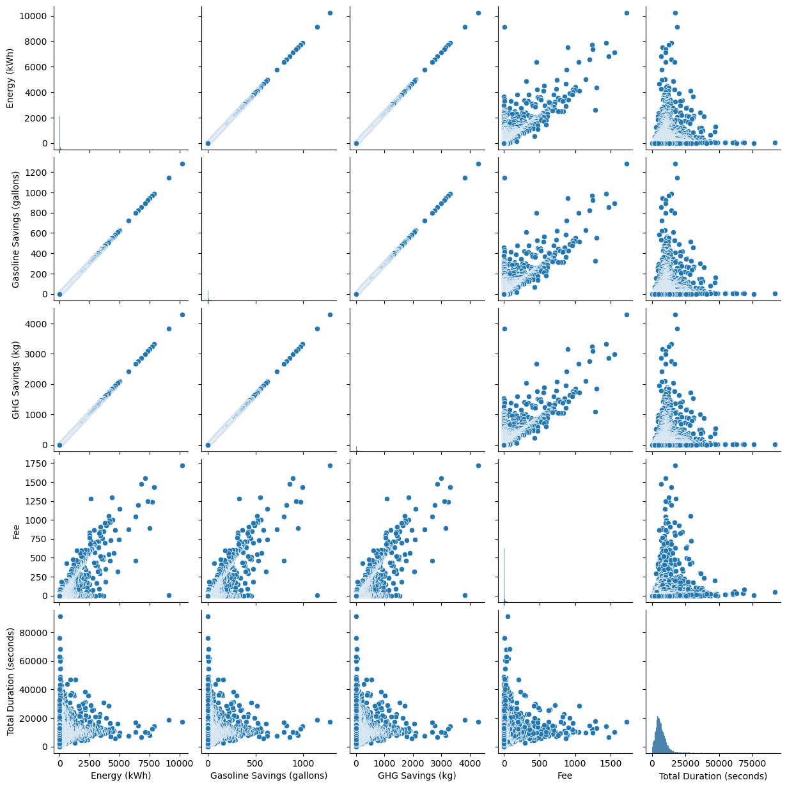
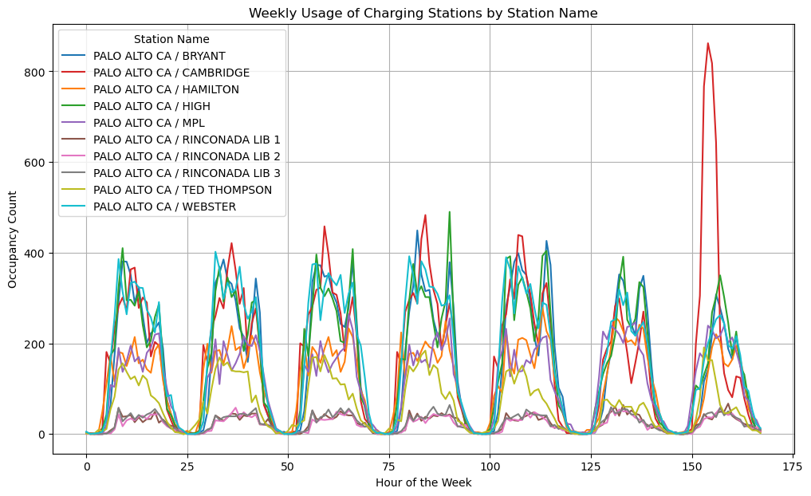

# Introduction

The global market for electric vehicles (EVs) is undergoing rapid transformation. Growing environmental consciousness and consumer enthusiasm for innovative, eco-friendly technologies are driving widespread EV adoption. However, there are still opportunities to refine and improve EV integration for the maximal benefit of both users and the larger energy grid.

In addition, we explore various social and economic elements which influence EV manufacturers and sales. Government incentives can significantly increase EV adoption rates. Additionally, the proximity of manufacturing centers, the accessibility of charging stations within a country, and other related legislation play critical roles in shaping consumer choices and manufacturer success. For this study, we focus on main markets as well as markets with the largest EV adoption such as Norway, seeking to understand the key factors driving success in these regions.

For deeper understanding of the problem at a local level, we use city of Palo Alto,located in Silicon Valley, California, which provides a unique lens into the dynamics of EV infrastructure. With high EV ownership and a forward-thinking approach to sustainability, the city presents a valuable case study for optimizing EV usage, charging patterns, and their impact on local power systems.

- Peak Demand Understanding: We do data analysis to understand when the most cars will be charging in Palo Alto. This information is essential for power grid management and stability.
- Dynamic Fee Estimation: Create a model that generates fee estimates for EV charging. Fees could change based on expected demand, incentivizing off-peak charging and optimizing power usage.
- Energy Expenditure Analysis: Track and analyze EV energy spending to understand the economic contributions of EV owners and potential fluctuations.

In addition, we found several datasets to further encompass a range of economic indicators, market indices, and demographic data from various regions around the world, providing opportunities to conduct comparative analyses, identify cross-border trends, and derive insights that inform strategic decision-making on a global scale.

# Current Trends with Electric Vehicles Worldwide

Electric vehicle sales are on the rise globally, as more people is deciding to switch to "greener" forms of transportation. This trend is driven by a growing awareness of environmental issues and a shared interest in eco-friendly technology. It is clear that both the hype around and the actual move toward electric mobility are accelerating, reflecting a collective effort to tackle climate change.

## Market Growth

- Sales of electric cars started from a low base but are growing quickly in many markets.
- Globally, around 1-in-4 new cars sold were electric in 2023. In **Norway**, this share was over 90%, and in **China**, it was almost 40%.
- In the following visualization, “electric cars” include fully battery-electric vehicles and plug-in hybrids.

The dataset is about a share of new cars sold that are electric for 13 years period (2010-2023), in other words, how many of total cars sold within a year were EVs. In the following section, USA (where Palo Alto is located) will be compared to Denmark, EU, Noraway and China. 

<iframe src="p1.html" style="width:100%;height:600px;border:none;"></iframe>

From the plot above it can be observed that Norway has the highest share of new cars that are electric by far, compared to other states. Such a result is expected, since Norway is also known for its very generous subsidy for EVs, as explained here https://alternative-fuels-observatory.ec.europa.eu/transport-mode/road/norway/incentives-legislations. Surprisingly, the USA is below the world's average, mostly due to the cheaper gas prices compared to other countries. Interestingly, China surpassed the EU in 2018 but still remained on lower sales than Denmark, which has the highest share of new cars that are electric within the EU.

## Fully-electric cars vs. plug-in hybrids
 
“Electric cars” include battery-electric and plug-in hybrid vehicles. The difference is that fully battery-electric cars do not have an internal combustion engine, whereas plug-in hybrids have a rechargeable battery and electric motor and an internal combustion engine that runs on gasoline.

- Plug-in hybrid could be driven as a standard petrol car if the owner did not charge the battery. 

- The battery in plug-in hybrids is smaller and has a shorter range than battery-electric cars, so over longer distances, the car starts running on gasoline once the battery has run out.

- Since plug-in hybrids will often run on petrol, they tend to emit more carbon than battery-electric cars. However, they do usually have lower emissions than petrol or diesel cars.

In the barcharts below we will compare the share of Battery-electric and Plug-in hybrid cars sold across different states and worldwide.

<iframe src="p2.html" style="width:100%;height:600px;border:none;"></iframe>

It can be observed that Norway and Denmark are the only ones from above which have decline of share of Plug-in hybrid cars sold in the last year. In all of the displayed bar plots, the exponential growth of Battery-electric EVs is observed. That implies growing awareness of environmental issues and a shared interest in eco-friendly technology, together with the partial transition towards fully electric cars by a large share of the population represented by Plug-in hybrid sales. Transition to fully electric cars has yet not been established due concernc about vehicle range, and many opt for hybrids or gasoline-fueled vehicles to travel longer distances.

## Top Manufacturers

Sales of plug-in electric vehicles (PEVs) grew rapidly from 2011 to 2018. Technology improvements, cost reduction, increasing model choice, maturing charging infrastructure, and economic recovery have continued to influence and support increased sales. Until 2018, the Chevrolet Volt had been on the market the longest and had the most overall sales, but the model was discontinued in 2019. In 2018, the newly introduced Tesla Model 3 rapidly increased vehicle sales and established the vehicle as the best-selling plug-in electric vehicle with nearly 50% of the market share. In the plot below, the top 10 EV manafacturers by total sales for period from 2012-2019 will be displayed.

<iframe src="p3.html" style="width:100%;height:600px;border:none;"></iframe>

From the plot above it can be observed that all the manufacturers have increased sales through the last 10 years. Until 2017 Chevrolet had the most sales, when Tesla took the lead with further exponential growth. That reflects a (closely correlated) share of new EVs sold worldwide.

# Case Study - Palo Alto

First things we did was to do simple cleaning of NaN values, duplicates and data type convertions into proper datetime and timedelta formats. This is crucial for later analysis of time-based patterns, allowing us to extract temporal insights. Advanced preprocessing steps are with wasserstein distance, where we comapre distributions of each charging station and remove stations which have usage below 28 times, as the average frequency is around 400, and compare distributions visually so they can't affect the predictive models later on. Pre-cleaning data has 259k rows with 33 features, post-cleaning we have 169k rows with the same number of features. Below see the average charging time acompanied by the grid plot, which capture the essence of our user centric approach to the EV charging problem.

<iframe src="p5.html" style="width:100%;height:600px;border:none;"></iframe>

As can be seen from the plot, the charging time follows a power law distribution with the average charging time of approximately 118 minutes where shorter charging times are more frequent than longer ones. After going through average charging times for electric vehicles we found out that batery charging follows a two-phase process; initially, the charging is fast, followed by a slower phase as the battery approaches full capacity.

</img>

The analysis reveals a power law relationship between total charging duration and energy consumption, with larger EV batteries generally requiring more energy. However, outliers exist where extended charging durations are observed despite minimal energy usage, typically attributable to instances where vehicles remain plugged in despite already being fully charged. Identifying and addressing these outliers can enhance the efficiency of charging infrastructure and ensure optimal utilization, ultimately improving our understanding of EV charging behaviors and the effectiveness of charging networks.

Next part is the obvious linear relationship GHG savings/gasoline savings, when looking at the data to get one from another just divide by 7.89. However, an interesting is the behaviours of fees. It acts as a linear relationship; however, it is unclear what is going on. Hence, we decided to delve deeper into this data. In the below sectors, we utilize average fee, energy spent, and charging time to understand the trend.

MOZDA PODNASLOVE DODAT DRUGDJE I OVDJE

In our data analysis, we employed a combination of statistical techniques, machine learning algorithms, and visualization tools to gain insights from the dataset. What we learned from the datasets, is two-fold: firstly, our Palo alto case-study dataset offers a record of charging activities within the city, providing insights into charging behaviors, energy consumption patterns, and infrastructure utilization among electric vehicle owners. Our main focus is the intersection of charging time, fees and energy spent/gasoiln saved. In the map below you can see the location of each charging station, so our dataset is not only a reference for a single city, but reflects a larger pattern which can be found in any larger city and country. \\
From a user perspective, what is important are fee, or the price that user is paying/saving compared to using traditional combustion engine. And, since the charging time duration always follows a similar pattern, and does not need prediction element, we use current energy prices combined with average charging time to present the user with the estimated fee he would pay if he started charging immediatelly. In addition, we estimate energy demand using a 30 day lag to predict the next day, giving users additional insight wether charging the next day is optimal.

<iframe src="my_map.html" style="width:100%; height:600px; border:none;"></iframe>

As can be seen from the map, the charging stations are located near Stanford University in the city centre.

</img>

The daily periodicity of the charging pattern in the Palo Alto EV charging dataset reveals a notable trend of larger crowds utilizing charging infrastructure during the day, potentially coinciding with work or leisure activities. On the other hand, charging activity tends to taper off during the early morning hours and at night, suggesting decreased demand during these periods. The peek demand seen for last day of the week is a special event occurence, which is accounted for in the models below.

 

<iframe src="p6.html" style="width:100%;height:600px;border:none;"></iframe>

<iframe src="p7.html" style="width:100%;height:600px;border:none;"></iframe>

<iframe src="p8.html" style="width:100%;height:600px;border:none;"></iframe>

<iframe src="p10a.html" style="width:100%;height:600px;border:none;"></iframe>

<iframe src="p10b.html" style="width:100%;height:600px;border:none;"></iframe>

## ML - Random Forest

<iframe src="p12.html" style="width:100%;height:600px;border:none;"></iframe>

When applying linear regression model, the data clearly shows that two types of crimes aren't related to each other. Instead, they seemed to be going in their own directions. On average, drug-related crimes were decreasing by about **500 incidents every year**, while assault cases were going up by about **333 incidents each year**. This shows how complicated these crime trends can be, and that there might be different reasons that impact each type of crime. 

# Conclusion

 